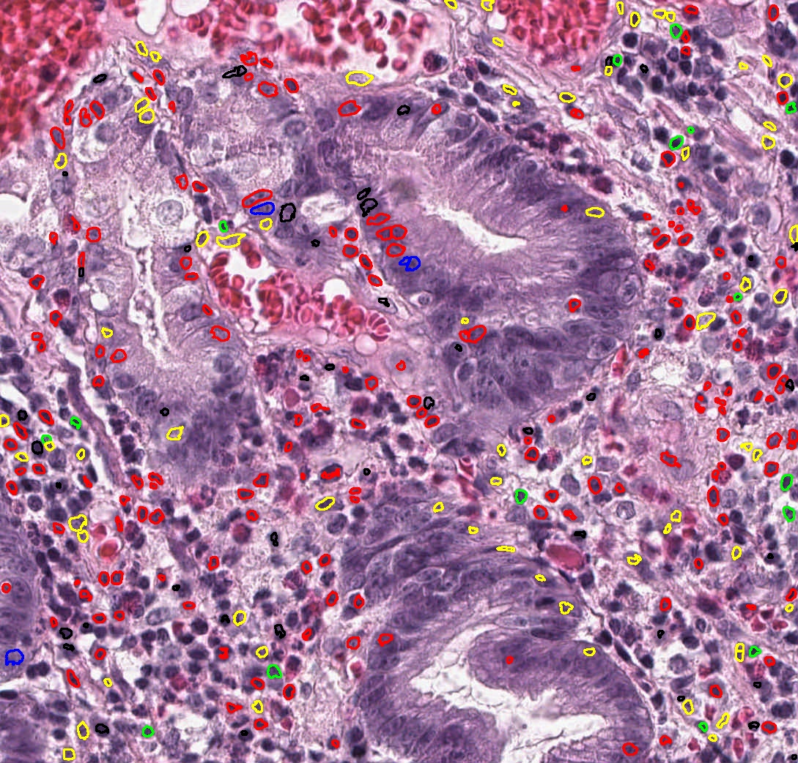

# Arontier 회사에서 진행한 Cell Instance Segmentation task
  - 목적 : 활용가능한 모든 datasets을 활용하여 회사 서버 내에 Cell Instance Segmentation model 구축.
  - 논문 : HoVer-Net: Simultaneous Segmentation and Classification of Nuclei in Multi-Tissue Histology Images 참고.


## Result

If you want more about the result, refer to ``` examles/usage.ipynb ```

|  Input(삼성병원 위암 데이터) |  Output(no class) |  Output(class) |
| --- | --- | --- |
||||


## Environment

```
conda env create -f environment.yml
conda activate hovernet
pip install torch==1.6.0 torchvision==0.7.0
```

---

## Quick Inference

_※※※※NOTE※※※※_

Dataset : Note that you can put 2 types of input(tile and svs).
You have to firstly make the input directory and put them in it.

Magnification : It would be no problem whether your data is 20x or 40x.

Output : After finishing the process, you will get overlay map in output directory as result and the number of centroid 
will be printed in the log.


pretrained weight : Download pretrained weights [here](https://drive.google.com/drive/folders/1-gRXip1d3e1bfAoBsbJxWMkew2Ybr_eS)
and put them in './weight'.

_※※※※NOTE※※※※_


### 1. Input type : tile  (any size of jpg, png, tif,  etc..)

**1-1.  Only Segmentation**

- run this code ``` python run_infer.py --gpu 0 --model_mode 'original' --nr_type 0 --model_path 'weight/Epoch299_TestLoss0.7766(consep_kumar_tnbc)_notype.pth' tile --input_dir ★input dir★ --output_dir ★output dir★ ```
    

 
**1-2 . Segmentation + Classification**

 - firstly, modify the 177th code in hovernet/run_desc.py
   (patch_imgs_gpu = patch_imgs.to("cuda").type(torch.float32) / 255
    -> patch_imgs_gpu = patch_imgs.to("cuda").type(torch.float32))


 - run this code ``` python run_infer.py --gpu 0 --model_mode 'original' --nr_type 5 --type_info_path 'type_info/type_info.json' --model_path 'weight/Epoch299_TestLoss0.7924(consep_kumar_tnbc_cpm17)_type.tar' tile --input_dir ★input dir★ --output_dir ★output dir★ ```
 


 
### 2. Input type : svs


**2-1.  Only Segmentation**

 - run this code ``` python run_infer.py --gpu 0 --model_mode 'original' --nr_type 0 --model_path 'weight/Epoch299_TestLoss0.7766(consep_kumar_tnbc)_notype.pth' wsi --input_dir ★input dir★ --output_dir ★output dir★ ```
 
 
 
**2-2 . Segmentation + Classification**

 - firstly, modify the 177th code in hovernet/run_desc.py
   (patch_imgs_gpu = patch_imgs.to("cuda").type(torch.float32) / 255
    -> patch_imgs_gpu = patch_imgs.to("cuda").type(torch.float32))


 - run this code ``` python run_infer.py --gpu 0 --model_mode 'original' --nr_type 5 --type_info_path 'type_info/type_info.json' --model_path 'weight/Epoch299_TestLoss0.7924(consep_kumar_tnbc_cpm17)_type.tar' wsi --input_dir ★input dir★ --output_dir ★output dir★ ```

 
 
 
 


---


## Inference Usage and Options

Usage: <br />
```
  run_infer.py [options] [--help] <command> [<args>...]
  run_infer.py --version
  run_infer.py (-h | --help)
```

Options:
```
  -h --help                   Show this string.
  --version                   Show version.

  --gpu=<id>                  GPU list. [default: 0]
  --nr_types=<n>              Number of nuclei types to predict. [default: 0]
  --type_info_path=<path>     Path to a json define mapping between type id, type name, 
                              and expected overlay color. [default: '']

  --model_path=<path>         Path to saved checkpoint.
  --model_mode=<mode>         Original HoVer-Net or the reduced version used in PanNuke / MoNuSAC, 'original' or 'fast'. [default: fast]
  --nr_inference_workers=<n>  Number of workers during inference. [default: 8]
  --nr_post_proc_workers=<n>  Number of workers during post-processing. [default: 16]
  --batch_size=<n>            Batch size. [default: 128]
```

Tile Processing Options: <br />
```
   --input_dir=<path>     Path to input data directory. Assumes the files are not nested within directory.
   --output_dir=<path>    Path to output directory..

   --draw_dot             To draw nuclei centroid on overlay. [default: False]
   --save_qupath          To optionally output QuPath v0.2.3 compatible format. [default: False]
   --save_raw_map         To save raw prediction or not. [default: False]
```

WSI Processing Options: <br />
```
    --input_dir=<path>      Path to input data directory. Assumes the files are not nested within directory.
    --output_dir=<path>     Path to output directory.
    --cache_path=<path>     Path for cache. Should be placed on SSD with at least 100GB. [default: cache]
    --mask_dir=<path>       Path to directory containing tissue masks. 
                            Should have the same name as corresponding WSIs. [default: '']

    --proc_mag=<n>          Magnification level (objective power) used for WSI processing. [default: 40]
    --ambiguous_size=<int>  Define ambiguous region along tiling grid to perform re-post processing. [default: 128]
    --chunk_shape=<n>       Shape of chunk for processing. [default: 10000]
    --tile_shape=<n>        Shape of tiles for processing. [default: 2048]
    --save_thumb            To save thumb. [default: False]
    --save_mask             To save mask. [default: False]
```
