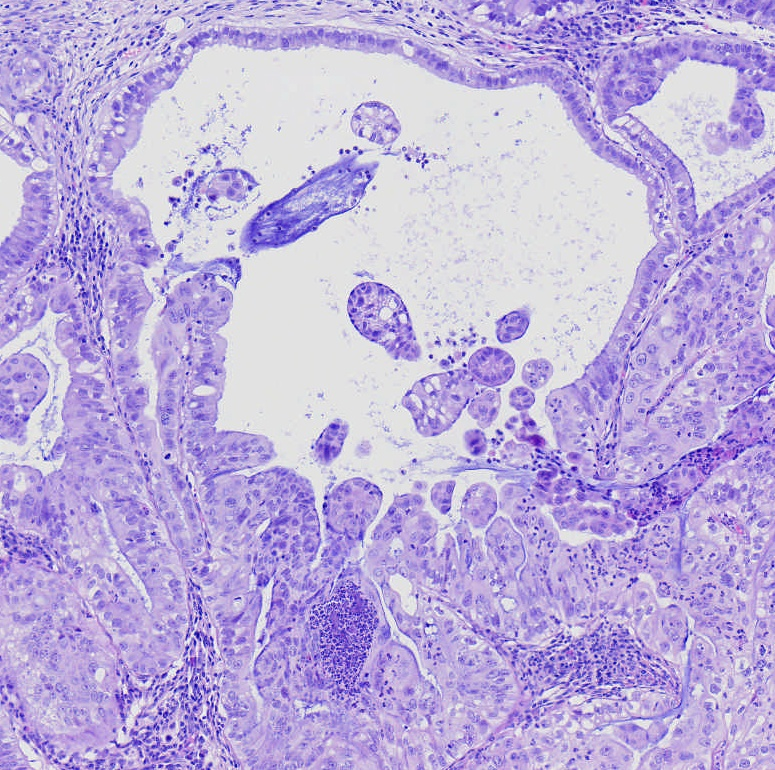
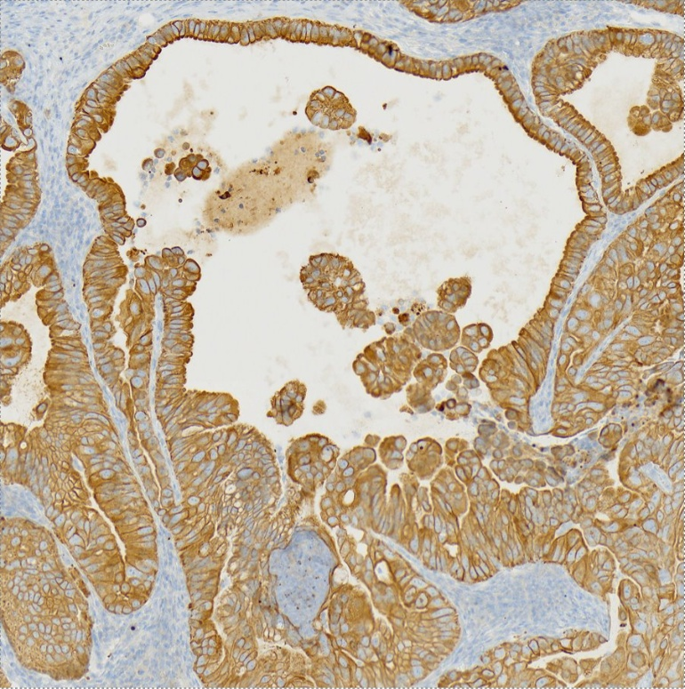
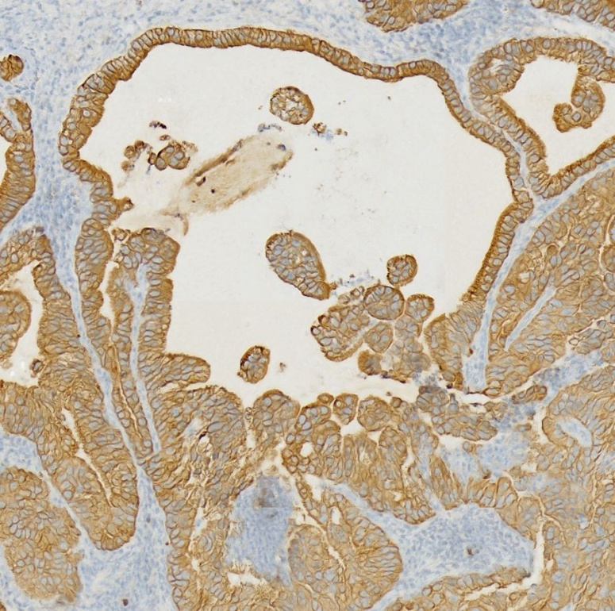

# Arontier 회사에서 진행한 HE, CK Task
  - 목적 : Hematoxylin & Eosin 염색된 Image로 부터 Cytokeratin 염색된 Image 자동 생성 알고리즘 개발
  *  HE 염색법 : cheap but less informative,
      CK 염색법 : expensive but more informative 

  - If you want datasets to train, send request email to my email(hnefa335@gmail.com)


## Result Sample

|  Input(삼성병원 간암 데이터 (2103))| Ground Truth |  Prediction |
| --- | --- | --- |
||||


## Process

### 1. Image Registration (image preprocessing and make datasets):
 - 배경 : 현미경으로 관찰하여 만든 HE, CK image는 약간의 상하좌우 거리가 차이날 수 밖에 없음.
   따라서 training을 위한 patch를 추출하기 위해서는 가장 먼저 Image Registration이라는 방법을 통해 두 이미지를 
   맞춰줄 필요가 있음
   
  1-1 ```GetRegistrationCoordinate.py ``` 파일 실행:
   - 파일 실행 전, input file의 경로, output npy file의 경로를 먼저 설정 해줄 것. 
   - 파일 실행 후, output npy file의 경로에 registration 결과가 담긴 npy file이 저장될 것임.
   
  1-2 ```MakePatch.py ``` 파일 실행:
   - 파일 실행 전, input image, npy file의 path를 알맞게 설정.  
   - 파일 실행 후, Local(10000 x 10000) 별로 patch (dataset)가 생성될 것임.
   - Local별로 생성된 patch를 시각화 하고 싶은 경우, ``` Local Patch Visualization.ipynb ``` 파일을 통해 시각화 결과를 볼 수 있음.
   - 사용자가 적절한 선택에 따라 시각와 결과를 토대로 resistration이 잘 된 data와 잘 안된 data를 구분하여 train, test 폴더를 생성한 후 그 안에 넣어줄 것.


### 2. Deep Learning (Training GAN (pix2pix)):
  - 1-1 ```train.py ``` 파일 실행:
    -  파일 실행 전, custom dataset의 input path를 알맞게 설정.
    
  - 1-2 ```test.py ``` 파일 실행:
    - 파일 실행 전, 예측하고 싶은 svs 파일의 path를 수정.
    - 파일 실행 후, patch 별로 예측 후 각각을 stitch하여 완성된 전체파일이 jpg파일로 저장될 것임. (pretrained weight는 이메일 )
